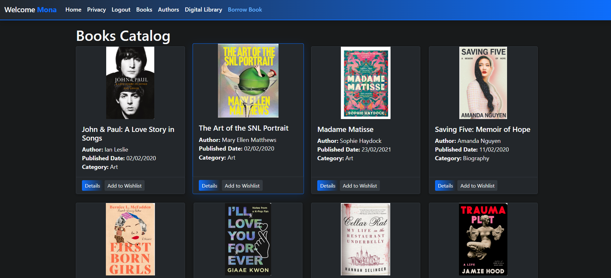
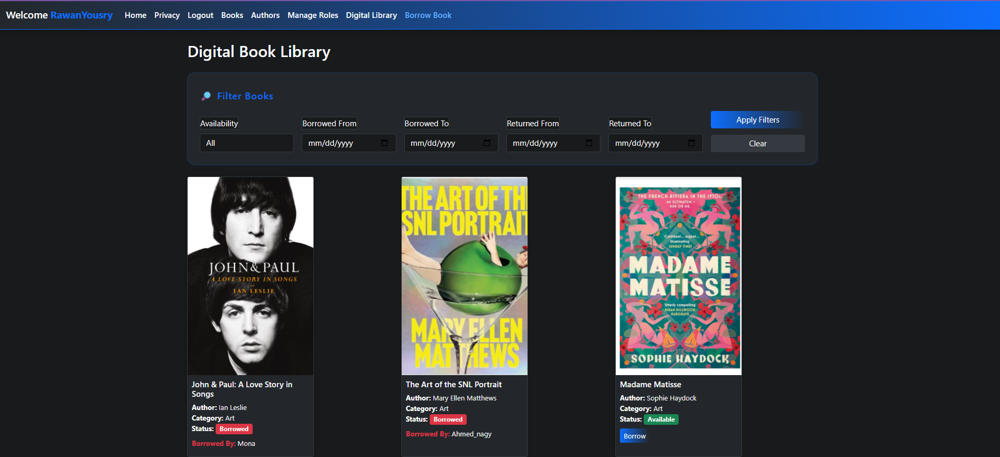
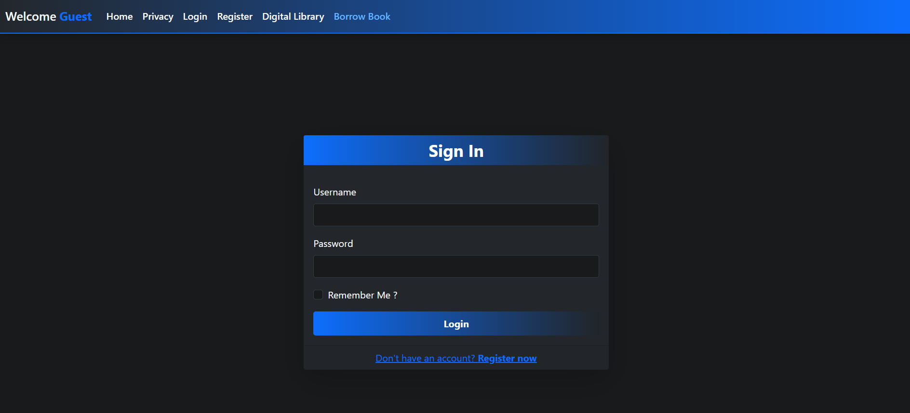
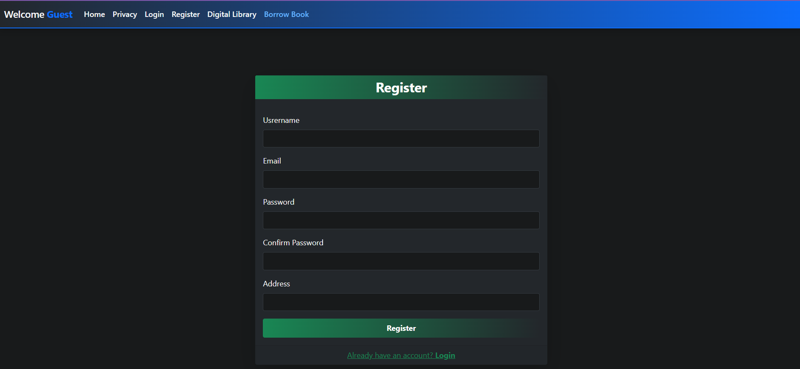

# 📚 Library Management System

A digital book library management system built using **ASP.NET Core MVC**, following **N-Tier Architecture** with the **Repository Pattern** and **Unit of Work**.

---

## 🚀 Features

### ✅ Core Functionalities
- 📖 **View Books**  
  - Displays books with title, author, category, availability status, and cover image.
- 🔎 **Filter Books**  
  - Filter books by:
    - Availability (Available / Borrowed)
    - Borrowed Date (From - To)
    - Returned Date (From - To)
- 📥 **Borrow Book**
  - Users can borrow available books.
  - Sets `BorrowedBy`, `BorrowedDate`, and updates availability.
- 📤 **Return Book**
  - Only the user who borrowed the book can return it.
  - Sets `ReturnedDate`, clears `BorrowedBy`, and updates availability.

---

### 💻 JavaScript Interaction
- 🧠 **Dynamic Availability Status**
  - In the `NewBorrowBook` view, users select a book from a dropdown.
  - JavaScript fetches and displays its current availability status in real time.
  - The "Borrow" button is enabled/disabled based on the book’s availability.

---

## 🧱 Architecture

This project uses **N-Tier Architecture**:

- **Presentation Layer**
  - ASP.NET Core MVC controllers and Razor views
  - Uses ViewModels for strongly typed data binding

- **Service Layer**
  - Business logic (e.g., borrow/return validation)
  - Depends on interfaces for repository access

- **Data Access Layer**
  - Entity Framework Core with Repository and Unit of Work patterns
  - Manages database interactions and transactions

---

## 🛠️ Technologies Used

| Technology           | Purpose                                |
|----------------------|-----------------------------------------|
| ASP.NET Core MVC     | Web framework                          |
| Entity Framework Core| ORM for data access                    |
| SQL Server           | Database                               |
| Repository Pattern   | Abstracts data operations              |
| Unit of Work         | Groups related repository operations   |
| ASP.NET Identity     | User authentication and management     |
| Razor Views          | Server-side rendering                  |
| Bootstrap            | Responsive UI design                   |
| JavaScript/jQuery    | Client-side interactivity              |
| LINQ                 | Querying data                         |
| TempData             | Flash success/error messages           |

---

## 📷 Screenshots

| 📚 Book Library | 📖 Book Actions |
|----------------|----------------|
|  |  |
| 🔐 Authentication |
|----------------|----------------|
|  |  |


---

## 📌 Getting Started

1. Clone the repository:
   ```bash
   git clone https://github.com/rawanysoliman/LibraryManagementSystem.git
  

2. Set your connection string in appsettings.json.
3.Apply migrations and update the database:
   ```bash
   dotnet ef database update
4.Run the application:
   ```bash
dotnet run
